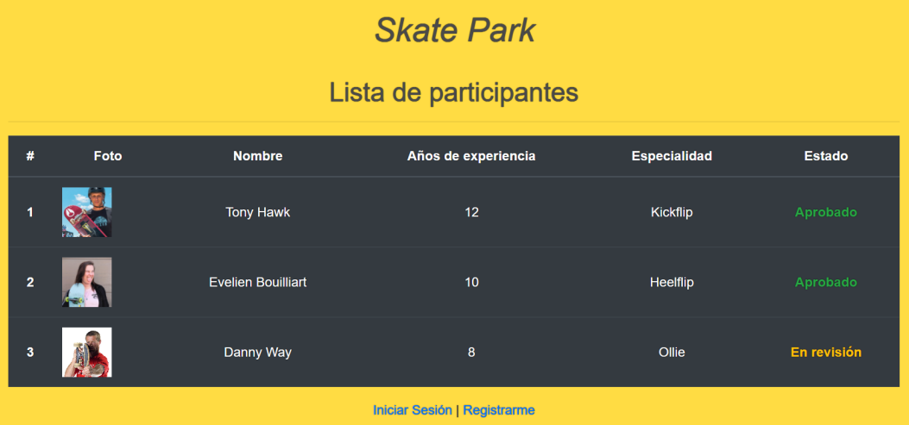
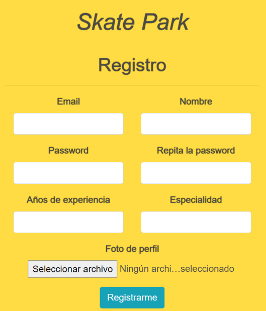
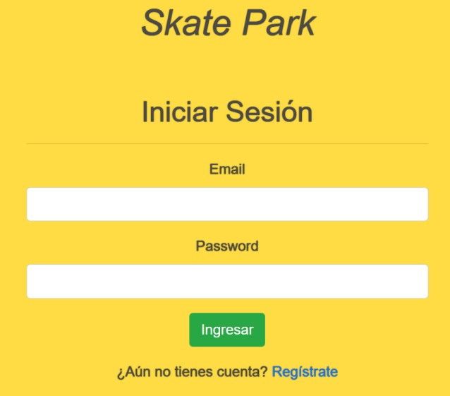
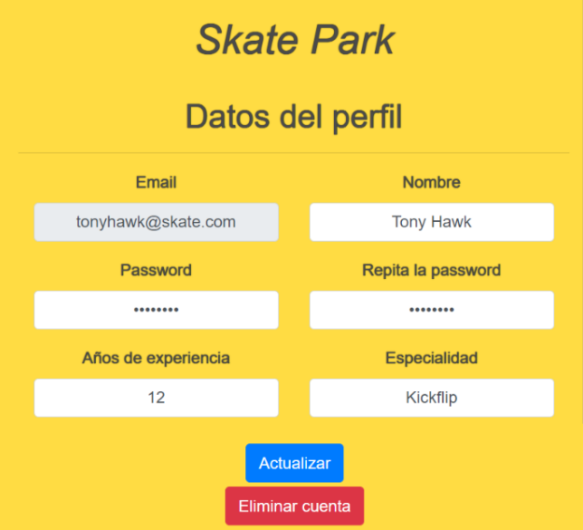
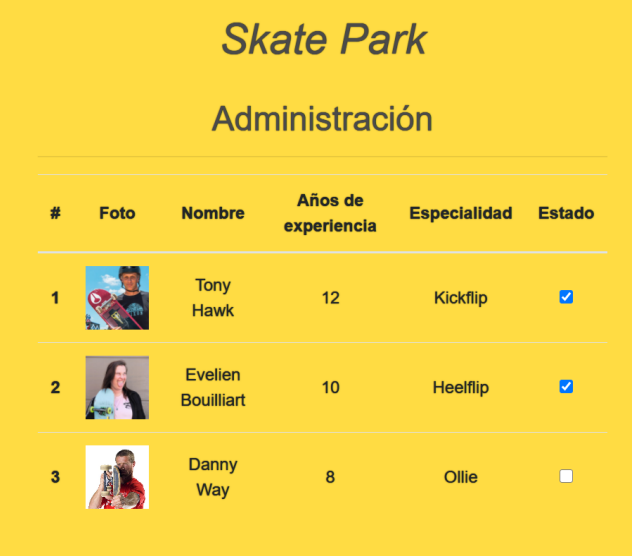

# Prueba final módulo - Skate Park

## Descripción

La Municipalidad de Santiago ha organizado una competencia de Skate para jóvenes que desean representar a Chile en los X Games del próximo año. Necesitan una plataforma web donde los participantes puedan registrarse y revisar el estado de su solicitud. Tu tarea es desarrollar un sistema web completo utilizando tus habilidades de Full Stack Developer.

## Vista del Diseño

A continuación, se muestra una imagen de la interfaz cliente preparada para interactuar con el servidor:

## Requerimientos

### 1. Crear una API REST con el Framework Express

- Implementa rutas para registrar nuevos participantes, iniciar sesión, modificar datos del perfil y administrar la lista de participantes.
  
### 2. Servir Contenido Dinámico con express-handlebars

- Utiliza Handlebars para renderizar las vistas dinámicamente en el servidor.

### 3. Ofrecer la Funcionalidad Upload File con express-fileupload

- Permite a los participantes cargar una foto como parte del registro.

### 4. Implementar Seguridad y Restricción de Recursos o Contenido con JWT

- Protege las rutas que requieren autenticación, como la modificación de datos del perfil y las vistas de administración, usando JWT. Los datos deben ser extraídos del token para autenticar al usuario.

## Tecnologías y Herramientas

- **Express**: Framework para crear el servidor.
- **Handlebars**: Motor de plantillas para servir contenido dinámico.
- **PostgreSQL**: Base de datos para persistir la información de los participantes.
- **JWT**: Para la seguridad y restricción de recursos.
- **Express-fileupload**: Para manejar la carga de archivos.
  
## Autor

Este proyecto fue desarrollado por **Valeria Torrealba**.
